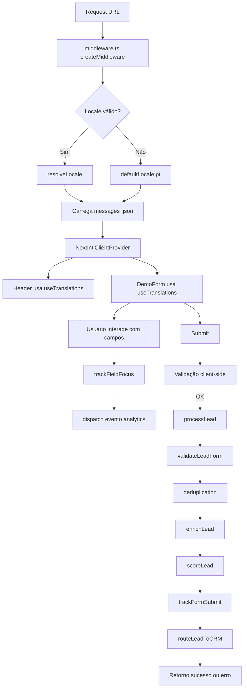
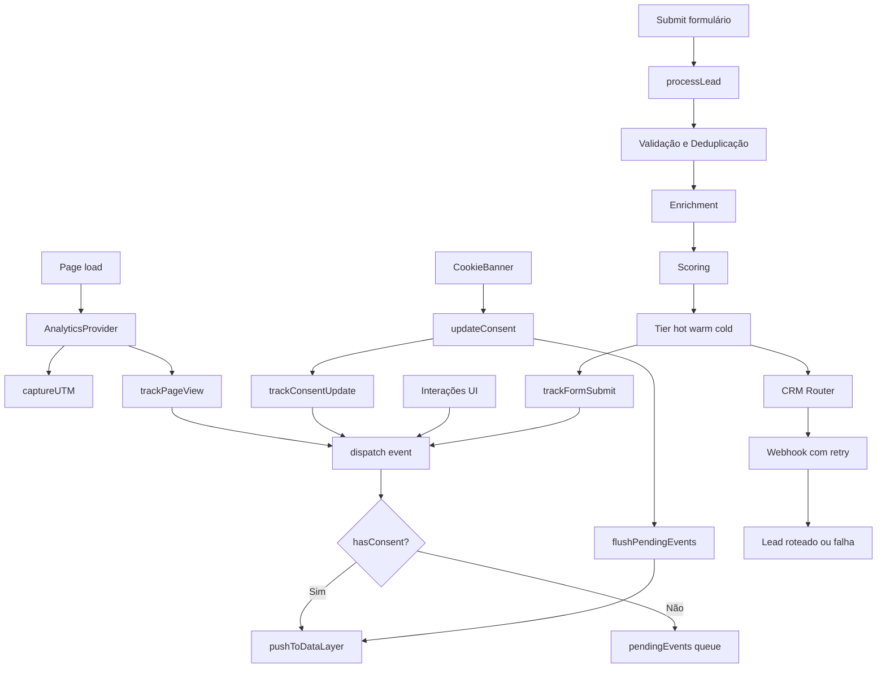

# TRACTIAN – Challenge for Mid Web Developer 

Pixel-perfect reproduction of [tractian.com/en/who-we-serve/plant-manager](https://tractian.com/en/who-we-serve/plant-manager) with full i18n support (EN, PT, ES).

**[→ Live Demo](https://tractian.moitinho.dev/en/who-we-serve/plant-manager)**

---

## Tech Stack

| Category | Technology | Why |
|----------|-----------|-----|
| Framework | Next.js 14.2 (App Router) | Matches TRACTIAN's production stack |
| Language | TypeScript | Type safety across components and i18n |
| Styling | Tailwind CSS | Utility-first, fast iteration for pixel-matching |
| i18n | next-intl | Localized pathnames, server components, type-safe |
| Carousel | Swiper.js | Same library used by the original site |
| Animations | Framer Motion | Smooth section transitions and accordions |
| Icons | Lucide React | Lightweight, tree-shakeable |
| Deploy | Vercel | Native Next.js integration, edge network |

## i18n Routes

Each locale has its own URL structure, matching TRACTIAN's real routing:

| Locale | URL Path |
|--------|----------|
| English | `/en/who-we-serve/plant-manager` |
| Português | `/solucoes-para-gerentes-industriais` |
| Español | `/es/who-we-serve/gerente-de-planta` |


## Prerequisites

- **Node.js** >= 18.17 (LTS 22 recommended) — see `.nvmrc`
- **npm** >= 9

## Getting Started

```bash
git clone https://github.com/eumoitinho/tractian-challenge.git
cd tractian-challenge
nvm use            # uses .nvmrc (Node 22)
npm install
npm run dev
```

Open [http://localhost:3000/en/who-we-serve/plant-manager](http://localhost:3000/en/who-we-serve/plant-manager)

## Project Structure

```
.
├── messages/
│   ├── en.json
│   ├── es.json
│   └── pt.json
├── public/
│   └── icons/
│       ├── carousel/
│       ├── cookies/
│       ├── footer/
│       ├── header/
│       │   ├── company/
│       │   ├── resources/
│       │   ├── solutions/
│       │   └── who-we-serve/
│       └── sections/
├── src/
│   ├── app/
│   │   ├── [locale]/
│   │   │   ├── layout.tsx
│   │   │   ├── page.tsx
│   │   │   └── who-we-serve/plant-manager/page.tsx
│   │   ├── fonts/
│   │   ├── layout.tsx
│   │   └── page.tsx
│   ├── components/
│   │   ├── analytics/
│   │   │   └── AnalyticsProvider.tsx
│   │   ├── layout/
│   │   │   ├── Header/
│   │   │   │   ├── Header.tsx              # Thin orchestrator
│   │   │   │   ├── index.ts                # Barrel export
│   │   │   │   ├── desktop/
│   │   │   │   │   ├── DesktopDropdowns.tsx
│   │   │   │   │   └── DesktopSolutionsDropdown.tsx
│   │   │   │   ├── mobile/
│   │   │   │   │   ├── MobileMenu.tsx
│   │   │   │   │   ├── MobileNavSection.tsx
│   │   │   │   │   └── content/            # Per-section accordion bodies
│   │   │   │   └── shared/
│   │   │   │       ├── HeaderIcons.tsx
│   │   │   │       ├── IconBox.tsx
│   │   │   │       ├── TractianLogo.tsx
│   │   │   │       ├── LanguageSwitcher.tsx
│   │   │   │       └── constants.ts
│   │   │   ├── CookieBanner.tsx
│   │   │   ├── CookiePrivacyWrapper.tsx
│   │   │   ├── Footer.tsx
│   │   │   └── PrivacyModal.tsx
│   │   └── sections/
│   │       ├── DemoForm.tsx
│   │       ├── DemoFormModal.tsx
│   │       └── ...
│   ├── i18n/
│   │   ├── request.ts
│   │   └── routing.ts
│   ├── lib/
│   │   ├── analytics/
│   │   │   ├── consent.ts
│   │   │   ├── data-layer.ts
│   │   │   ├── dispatcher.ts
│   │   │   ├── events.ts
│   │   │   ├── use-form-analytics.ts
│   │   │   ├── use-section-tracking.ts
│   │   │   └── utm.ts
│   │   ├── lead-pipeline/
│   │   │   ├── crm-router.ts
│   │   │   ├── deduplication.ts
│   │   │   ├── enrichment.ts
│   │   │   ├── pipeline.ts
│   │   │   ├── scoring.ts
│   │   │   ├── types.ts
│   │   │   └── validators.ts
│   │   ├── demo-modal-context.tsx
│   │   ├── privacy-modal-context.tsx
│   │   └── utils.ts
│   ├── middleware.ts
│   └── styles/globals.css
├── next.config.mjs
├── package.json
├── tailwind.config.ts
└── tsconfig.json
```

## Architecture Decisions

**App Router over Pages Router** — Server components by default reduce client JS. Layouts handle locale providers cleanly without prop drilling.

**Locale-aware content, not just translations** — Each JSON file contains region-specific testimonials, logos, hero images, and FAQ counts. Components read these dynamically via `useMessages()` instead of hardcoded arrays.

**Remote images from TRACTIAN's CDN** — No local asset duplication. Images load directly from `imgix.tractian.com` and `tractian-webpage.s3.amazonaws.com`, same as production.

**CSS-only logo carousel** — Infinite scroll via `@keyframes` and duplicated DOM. No JS interval, no layout thrashing, no jank.

**Form validation client-side only** — As specified in requirements. Uses controlled inputs with real-time feedback, loading state, and success confirmation.

---

## Fluxogram: i18n + forms



## Fluxogram: Analytics (end-to-end)




## Development Process & Tooling

This section documents how I approached the pixel-perfect reproduction, what tools I used to extract design information from the original site, and how I used AI to accelerate development.

### Inspection & Measurement Tools

Reproducing a page pixel-perfect requires extracting exact values from the original. Here's what I used:

**Chrome DevTools** — Primary tool. `Ctrl+Shift+C` for quick inspect, "Computed" tab for final rendered values (`font-size`, `line-height`, `padding`, `gap`, `border-radius`). The grid/flex overlays were essential for understanding TRACTIAN's layout structure. Holding `Alt` while hovering measures distances between elements.

**[VisBug](https://chromewebstore.google.com/detail/visbug/cdockenadnadldjbbgcallicgledbeoc)** — Chrome extension that provides a visual toolbar for inspecting spacing, typography, and colors directly on the page without opening DevTools. Especially useful for quickly comparing my implementation side-by-side with the original — hover an element and immediately see font family, weight, size, color, and box model.

**[Polypane](https://polypane.app/)** — Multi-pane browser for responsive testing. Allowed me to view the original page at multiple breakpoints simultaneously, identifying exactly where TRACTIAN's responsive breakpoints trigger and how the layout shifts. Also used its layout debugging and element inspection features to understand component nesting and structure.

**[DivMagic](https://www.divmagic.com/)** — Browser extension that converts any element on a page to Tailwind CSS / React code. I didn't copy-paste output directly, but used it as a reference to validate my Tailwind class choices against the original computed styles — particularly useful for complex gradient backgrounds, backdrop-blur values, and shadow definitions.

**Console Scripts** — For batch-extracting styles from multiple elements at once:

```javascript
const el = document.querySelector('.target-selector');
const s = window.getComputedStyle(el);
console.log({
  fontSize: s.fontSize, fontWeight: s.fontWeight,
  lineHeight: s.lineHeight, letterSpacing: s.letterSpacing,
  color: s.color, padding: s.padding, gap: s.gap,
});
```

### AI-Assisted Development (Claude)

I used Claude (Anthropic) as a development accelerator throughout this project. Here's specifically how:

**Content extraction & i18n structuring** — I provided Claude with the three page URLs (EN, PT, ES) and had it fetch and structure the content into locale JSON files. This saved hours of manual copy-paste and ensured consistent JSON structure across all three languages. I validated the output against the real pages to catch any discrepancies.

**Component scaffolding** — I described each section's structure and behavior (e.g. "accordion with 4 items, first open by default, with an image that changes per item") and Claude generated the initial component code with TypeScript types and Tailwind classes. I then refined styling, animations, and edge cases manually using the inspection tools above.

**Prompt approach** — Rather than asking Claude to "build the whole page", I worked section-by-section with specific, scoped requests:

- *"Create a Testimonials component using Swiper.js with autoplay, pagination dots, and this data structure"*
- *"The WhyChoose section has an accordion on the left and an image on the right that swaps per active item. Here's the content from the EN page."*
- *"Fix the routing.ts — here are the real URLs from each locale"*
- *"The Header has full-width dropdown panels for Solutions and Who We Serve. Here's the structure I inspected with DevTools."*


---

## Deploy

[](https://vercel.com/new/clone?repository-url=https://github.com/eumoitinho/tractian-challenge)

```bash
npm run build
npm start
```

---

[moitinho.dev](https://moitinho.dev) · [GitHub](https://github.com/eumoitinho) · [LinkedIn](https://linkedin.com/in/eumoitinho)
